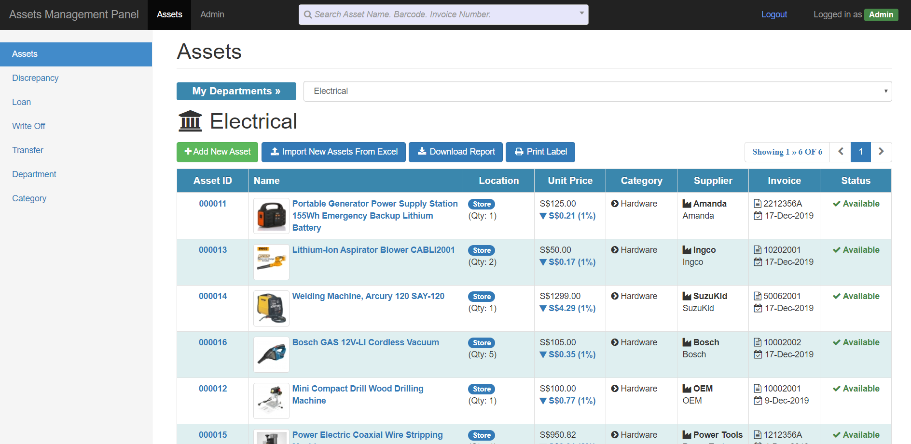
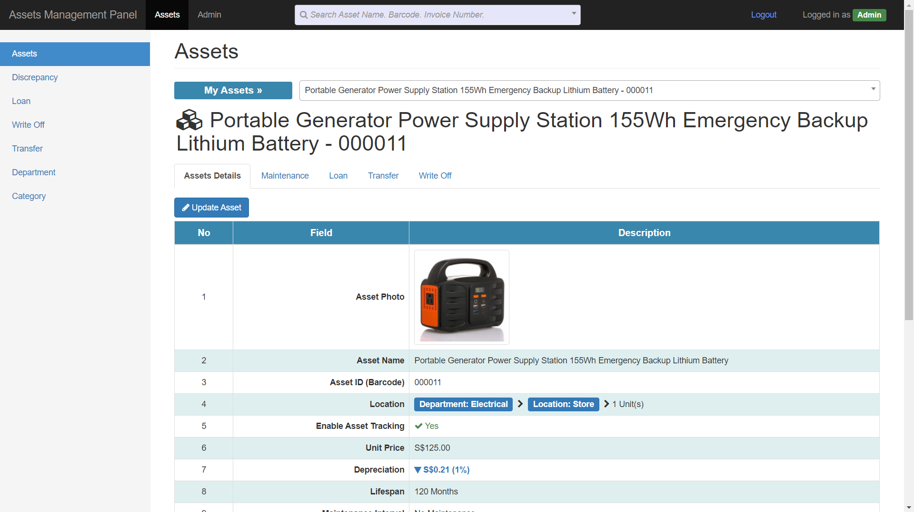
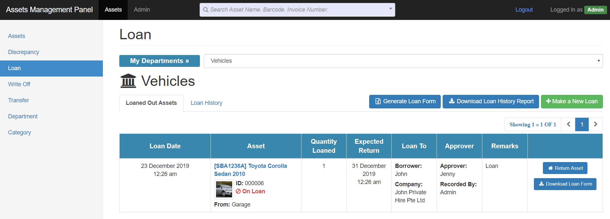
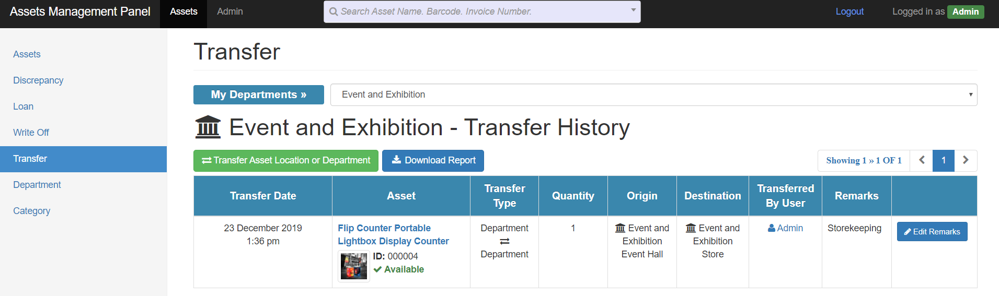
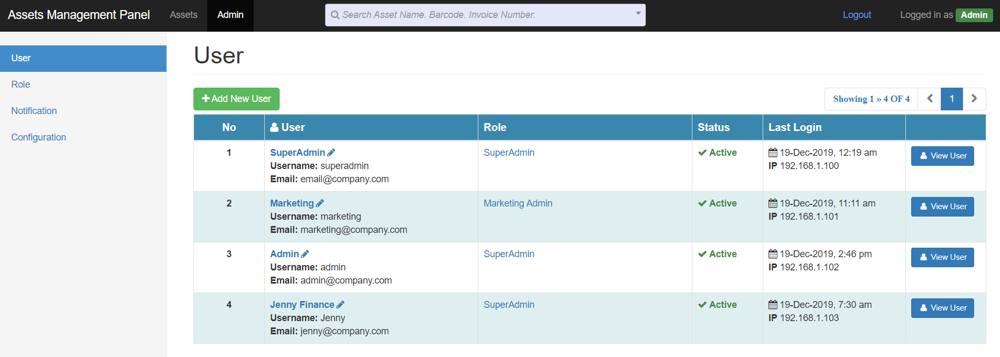
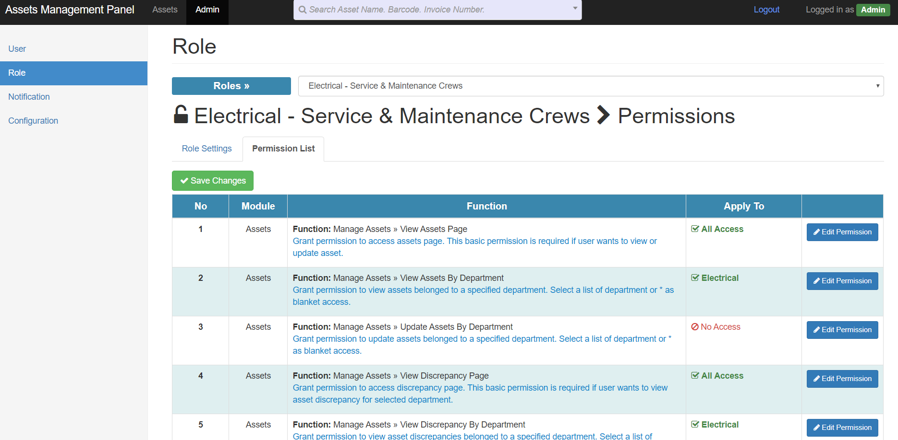

# Assets Tracking and Management System (AMS)

KennyKee Technologies' Assets Tracking and Management System (AMS) is an solution designed to streamline the management of physical assets across various industries. It enhances operational efficiency, accountability, and security in asset handling.

> **Note:** This is a legacy system built on **CodeIgniter 3.1.11**.

📖 [View information in KennyKee Technologies](https://www.kennykee.com.sg/Enterprise-System/Assets-Tracking-and-Management-System)

---

## Key Features

### 1. Asset Master List
Allow user to create assets, download asset depreciation report and print label sticker.

 

### 2. Discrepancy Checking
Allow user to do continuous stock take for valuable assets using handheld terminal and perform discrepancy checking for assets.

### 3. Asset Loan
User will be able loan out asset to external party or companies. This feature includes loan form generation and reporting.

 

### 4. Asset Write Off
Allow user to write off damaged or expired asset. Written off asset will be tracked and allow multiple levels of approval.

### 5. Asset Transfer
User will be able to transfer asset between department and location.

 

### 6. Department and Location
Department and location are the foundations for keeping track of assets.

### 7. User And Access Control
Fine grained access matrix to control read, add, update and delete operation for every individual function, user, role, and department in AMS.

 

 

### 8. Notification
Send notification to recipients for write off request and maintenance alert.

### 9. Job Scheduler
Job scheduler checks for assets due for maintenance.

### 10. Mobile And Tablet Application
Allow user to record asset quantity during stock take with Android handheld scanner.

---

## Hardware Integration 
AMS supports barcode, QR code scanning, RFID scanning and label printing functionalities for both Zebra and Honeywell devices. Our server, desktop client and android application are especially developed to fully utilize the capabilities of these devices. These include Zebra ZT510, TC51, ZD500, TC25, Honeywell RP series, CT60, CN80, PM42 and many more. 

## Benefits

- **Enhanced Operational Efficiency:** Automates asset tracking and management, reducing manual effort and errors.
- **Improved Accountability:** Provides visibility into asset usage and movement.
- **Regulatory Compliance:** Assists in meeting compliance requirements through detailed reporting and audit trails.
- **Cost Savings:** Reduces losses and mismanagement of assets.

## Use Cases

- **Manufacturing:** Track machinery and equipment for proper maintenance and utilization.
- **Healthcare:** Manage medical devices and supplies, ensuring availability and compliance.
- **Education:** Monitor educational tools and resources for efficient allocation.
- **Government:** Oversee public assets to ensure transparency and accountability.

---

## Contact Information

For more details or to request a demonstration:

- **Email:** [sales@kennykee.com.sg](mailto:sales@kennykee.com.sg)  
- **Business WhatsApp:** [+65 8199 6280](https://wa.me/6581996280)

---

## License

This project is licensed under the MIT License.  
See the [`LICENSE`](./LICENSE) file for full details.

